# Introduction

Cet atelier vous présentera les fonctionnalités clés du libre-service dans Oracle Analytics Server et illustrera ce qui se passe chez JTC America Group, un conglomérat fictif avec des opérations dans de multiples zones géographiques et segments couvrant un vaste portefeuille de produits.

Durée estimée : 45 minutes

**Objectifs de l'atelier**

Dans cet atelier, vous explorerez les fonctionnalités et capacités suivantes :

* Visualisation des données, Mash-Ups, lignes de tendance et prévisions
* Calculs et cartes personnalisés
* Aperçus automatiques

## Exercice 1 : Data Visualization et Mash-Ups

Pour démarrer notre analyse, nous allons créer un workbook. Imaginez un workbook comme un dashboard. Un workbook peut contenir une variété d'objets, notamment des filtres, des zones de texte et d'autres types de visualisation.

1.  **Cliquez** sur *"Create"* en haut à droite.

    

2.  **Cliquez** sur Workbook pour commencer un nouveau self-service workbook.

    

3.  **Sélectionnez** le Subject Area "Sample App" et **Cliquez sur** "Add to Workbook".

    Sample App permet d'accéder aux données que nous utiliserons pour réaliser notre analyse.

    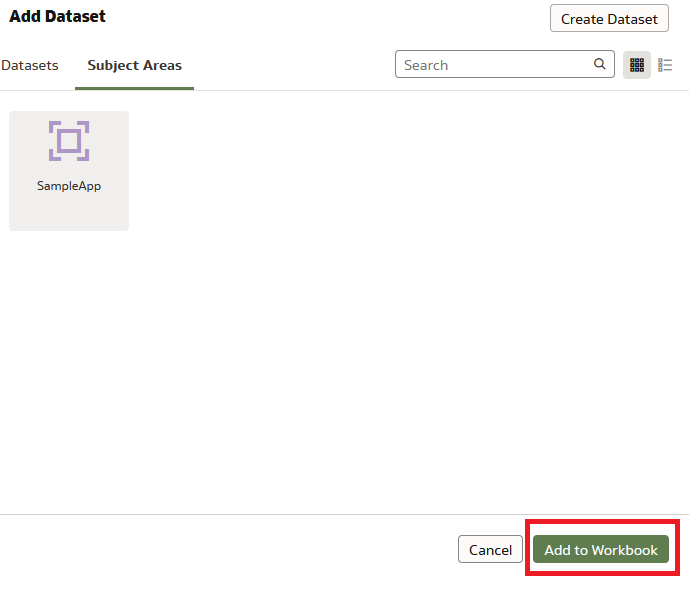

4.  Un canevas vide s'affiche. Commençons à visualiser ! Tout d'abord, voyons comment les ratios de produits sont répartis entre les différents types de produits.
    1.  **Sélectionnez** "Products – Product Type" et "Profit Metrics – Profit Ratio %".
    2.  **Cliquez droit**, puis "Pick Visualization".

        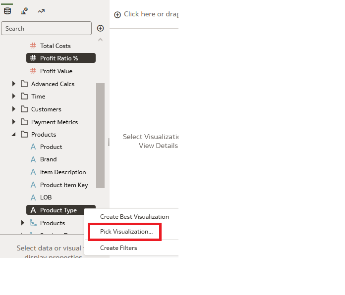

5.  **Choisissez** le graphique "Donut" .

    

6.  Observez le graphique sur le canevas. Vous pouvez voir que de tous les ratios de produits, "Audio" a le pourcentage de ratio de profit le plus bas.

    

7.  Essayons maintenant d'approfondir la question et de comprendre pourquoi le ratio de rentabilité des produits audio est inférieur à celui de nos autres types de produits. Voyons comment les produits de la catégorie "Audio" se sont comportés au fil du temps.

    Développez Time, Products, et Profit Metrics, puis **sélectionnez** *Product*, *Month* et *Profit Ratio %*. Faites-les ensuite **glisser** vers la gauche du graphique donut.

    Une ligne verte apparaît. Elle identifie l'emplacement de votre visualisation. Vous pouvez déposer la visualisation à gauche, à droite, en haut ou en bas de la visualisation précédente.

    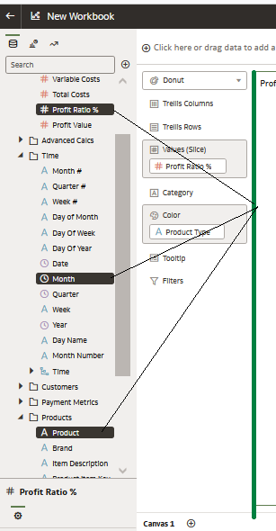

8.  Oracle Analytics Server offre des capacités graphiques adaptatives. Comme nous souhaitons examiner notre mesure sur une période donnée, Oracle Analytics a choisi de présenter les résultats sous la forme d'un graphique linéaire illustrant le ratio de profit, mois après mois.

    Ensuite, nous souhaitons examiner le ratio de profit pour chaque produit séparément afin d'obtenir plus de détails.

    **Faites glisser** "Produit" jusque **Treillis Rows**. Vous devriez voir un graphique individuel pour chaque produit, comme le montre l'image.

    

    Puisque nous nous intéressons au ratio de rentabilité du type de produit "Audio", nous allons filtrer jusqu'au niveau du produit. Pour ce faire, **faites glisser** "Products - Product Type" vers la section des filtres et sélectionnez "Audio".

    

    Observez que "MicroPod" a des ratios de profit en baisse et que "SoundX Nano" pourrait également être amélioré. Il peut y avoir plusieurs raisons à cela.

9.  Nous poursuivons notre enquête en examinant les niveaux de stock des produits. JTC America utilise un système tiers qui saisit les données relatives aux niveaux des stocks et de la demande de produits. J'ai besoin de ces données pour compléter mon analyse. Oracle Analytics permet d'accéder rapidement aux données d'inventaire et de les combiner avec notre analyse actuelle, le tout au sein d'une plateforme unique.

    Depuis le panneau data elements, Cliquez sur "+" et "Add Data" pour importer l'ensemble des données d'inventaire dans votre Workbook.

    

10. **Cliquez** sur "Create Data Set" puis "Drop data file here or click to browse".

    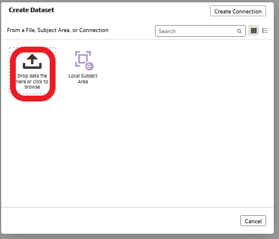

    Sélectionnez le fichier *“Inventory.xlsx”*. Ouvrez le fichier.

    

    Une fois la feuille de calcul téléchargée, cliquez sur "Ok" en bas a gauche de la fenêtre.

    

    Puis Sauvegardez le Dataset en cliquant en haut à droite de l’écran et nommez votre Dataset « Inventory »

    

11. Retournez à l'onglet "New Workbook" situé au-dessus de la zone du Workbook..

    Remarquez que le Dataset "Inventory" est disponible pour être ajouté au Workbook..

    **Sélectionnez** "inventory" et cliquez sur "Add to workbook"

    Définissons une relation entre le Subject Area - SampleApp et le Dataset inventory pour relier les sources de données en vue d'une analyse plus approfondie.

    En haut et au milieu du Workbook, vous remarquerez trois options de navigation - "Data" "Visualize" et "Present"

    **Cliquez** sur "Data"

    

    Dans Data, vous pouvez identifier les éléments de données clés et joindre vos sources de données. Oracle Analytics tentera de localiser les éléments de données qui sont étiquetés de la même manière et effectuera automatiquement la jointure si des étiquettes d'éléments de données identiques sont trouvées.

    Remarquez le diagramme de données. Le diagramme de données fournit une représentation graphique de vos sources de données et de leurs connexions. Notez qu'il n'y a pas de connexions. Déplacez votre curseur entre les sources de données "SampleApp" et "Inventory".

    Aucune correspondance n'a été identifiée, nous devons donc créer la nôtre.

    1.  **Cliquez** sur "0' entre les deux data sources.
    2.  **Cliquez** "Add Another Match"

        

        Depuis inventory

    3.  **Cliquez** sur "Select Data" set sélectionnez la colonne "ProductName”.

        

        Effectuez les mêmes étapes sur "SampleApp" et sélectionnez "Products - Product" pour relier les sources de données.

        Vous remarquerez que les sources de données sont jointes.

    4.  **Cliquez sur** "Visualize".

        

    5.  Explorez le panneau Data Elements sur la gauche. Notez que la feuille de calcul Inventaire est répertoriée sous SampleApp.

        

12. Maintenant que nous avons réussi à joinre nos données, poursuivons notre analyse. Maintenez le **contrôle et sélectionnez** "Product -\> Product" dans SampleApp et "Stock" et "Demand" dans Inventory.
    1.  **Cliquez** **droit** et **Sélectionnez** "Pick Visualization".

        

    2.  **Sélectionnez** "Bar"

        

13. Remarquez grammar panel pour la visualisation des barres. En plaçant les mesures "Stock" et "Demand" respectivement sur l'axe des ordonnées, le graphique devrait se présenter comme indiqué dans l'image..

    

    **Cliquez droit** sur n'importe quelle barre représentant "demand" et trier -\> "demand" -\> "Low to High".

    

    Voyez que le graphique se trie lui-même en fonction de la demande, de la plus faible à la plus forte..

    

    Le diagramme à barres montre que pour "MicroPod" et "SoundNano", la demande est supérieure au niveau de stock actuel.

    Pour les autres produits, la relation entre le stock et la demande n'est pas très différente. Nous sommes curieux de savoir pourquoi les niveaux de stock pour les deux produits sont inférieurs à la demande actuelle.

14. Nous décidons d'étudier les dettes et les créances. Pour poursuivre notre analyse, nous importons la feuille de calcul des paiements en suspens des fournisseurs que nous avons obtenue de notre système financier.

    **Importer** le feuille de calcul *VendorPayments.xlsx* en répetant les étapes de 9 à 12. Vous devriez maintenant voir l'ensemble de données pour les paiements des fournisseurs apparaître dans le panneau des éléments de données de l'écran d'accueil du workbook.

    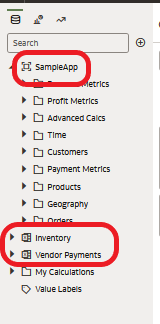

15. Créons une visualisation pour analyser les produits et les paiements des fournisseurs.

    Développez Products et VendorPayments, sélectionnez *Product* et *OutstandingPayment*. Puis, Cliquez **droit** et **sélectionnez** "Pick Visualization."

    

16. Sélectionnez "Tag Cloud".

    

17. Vous devriez voir une nouvelle visualisation sur le canevas. La visualisation montre que **MicroPod** et **SoundX** **Nano** sont les produits qui présentent le plus grand nombre de paiements fournisseurs en suspens.

    Il est possible que nos fournisseurs ne soient pas disposés à expédier les quantités commandées s'il existe des impayés importants sur le compte.

    Nous devons prendre des mesures pour résoudre ces problèmes de paiement.

    Pour compléter notre analyse, nous aimerions encore fournir quelques mesures et informations.

    Prévoyons le ratio de profit et la performance du chiffre d'affaires pour les mois à venir. Oracle Analytics Server offre des fonctions analytiques avancées faciles à utiliser, telles que les trendline, forecast, clustering ou outlier detection.

18. Commençons par ajouter un nouveau canevas. Pensez à un canevas comme à une page supplémentaire du classeur ou à une diapositive supplémentaire d'une présentation PowerPoint.

    **Cliquez** sur l’icone"+" situé en bas de l’écran pour créer un nouveau canevas. Sur le nouveau canevas, **Cliquez** sur le triangle inversé à droite de son nom. Sélectionnez "Canvas Properties".

    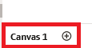

19. **Cliquez** "Auto Fit" et changez le avec "Freeform." **Cliquez** "Ok".
20. **Sélectionnez** "Profit Ratio %", "Revenue" et "Month". Cliquez droit et séléctionnez « Pick Visualization ». **Selectionnez** "Combo."

    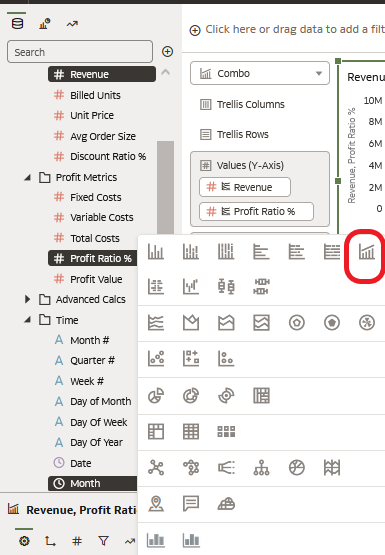

    Remarquez qu'en mode "freeform", tout le canevas n'est pas utilisé automatiquement.

21. Depuis le grammar panel **Cliquez droit sur** "Profit Ratio %" et sélectionnez "Y2-Axis." Elargissez la visualisation pour une meilleure vue.

    

22. **Sélectionnez** l'option "Analytics" dans le panneau de navigation à gauche. Glissez-déposez "Trend Line" sur la visualisation.

    

23. Vous avez maintenant créé un rapport de gestion qui présente à la fois le chiffre d'affaires et le ratio de rentabilité en % avec leurs lignes de tendance correspondantes, le tout sans codage.

    **Glissez et déposez** "Forecast" sur la visualisation et vous verrez les résultats prévus pour les deux mesures. Cela peut prendre quelques instants, veuillez patienter.

    

    Examinez les propriétés. Vous remarquerez que les prévisions portent sur le chiffre d'affaires et le ratio de rentabilité en % pour les trois mois à venir. Ces variables peuvent être modifiées selon les besoins de l'utilisateur.

    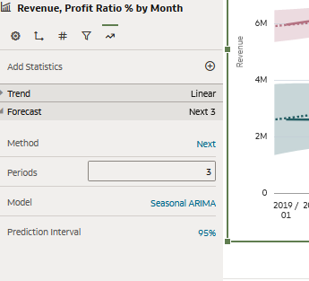

24. Il semble que nous soyons sur la bonne voie et que nos prévisions soient prometteuses. Ensuite, nous allons donner un aperçu historique de la performance des revenus en utilisant une visualisation personnalisée de carte thermique de calendrier que l’on peut trouver dans la bibliothèque Oracle Analytics Extensions.

    **Remarque:** Nous avons ajouté la visualisation personnalisée dans l'environnement pour vous. Si vous souhaitez apprendre à télécharger des types de visualisation personnalisés, veuillez consulter la section à la fin de ce document.

    Commençons par ajouter un nouvean canevas. Cliquez sur l'icône "+" en bas pour créer un nouveau canevas..

    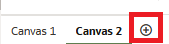

25. Développez Time et Revenue Metrics, **Sélectionnez** *Date* et *Revenue*. Puis, Cliquez **droit** et sélectionnez "Calendar Heatmap".

    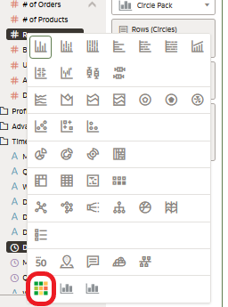

## Exercice 2 : Calculs personnalisés et utilisation de Cartes

Oracle Analytics Server offre des capacités de mappage avancées et la possibilité de créer des calculs personnalisés.

1.  Dans cet exercice, nous allons créer deux calculs personnalisés, puis utiliser les fonctions de cartographie intégrées en libre-service d'Oracle pour analyser l'état et le bénéfice moyen par client.

    Commençons par ajouter un nouveau canevas.

    **Cliquez** sur l’icône "+" en bas de la page pour créer un nouveau canevas.

    

2.  **Cliquez droit** sur "My Calculations". **Sélectionnez** "Add Calculation".

    

3.  Nous allons utiliser le générateur d'expressions pour créer une nouvelle mesure appelée " Profit by Customer Count ". Vous remarquerez qu'il existe un large éventail de fonctions permettant de créer des calculs personnalisés.
4.  **Sélectionnez** "Profit Value" depuis "Profit Metrics" et **glissez**/**déposez** dans la zone de dialogue du calcul. Saisissez "/" après "Profit Value" puis glissez/déposez "\# of Customers" depuis "Revenue Metrics" après le "/." Cliquez Validate. Cliquez Save.

    Vous avez réussi à créer votre calcul personnalisé qui peut être utilisé comme n'importe quelle autre mesure.

    

5.  Utilisons notre calcul personnalisé dans quelques visualisations.

    **Sélectionnez** "Country Name" dans "Geography". Faites-le glisser et déposez-le en haut à gauche du canevas, juste au-dessus du canevas, à l'endroit où il est indiqué "Cliquez here or drag data to add a filter." **Filtrez** sur "United States" en saisissant "uni" et sélectionnez "United States".

    

    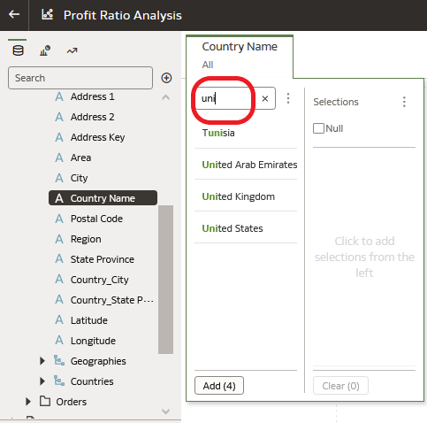

6.  **Sélectionnez** "State Province" depuis "Geography" et votre nouveau calcul personnalisé sous "My Calculations." Faites-les glisser et déposez-les sur le canevas. Remarquez que tous les États ne font pas de bénéfices.

    

    Voyons ce que cela donne sur une carte.

7.  Dans le coin supérieur droit du visuel, **cliquez** sur les trois points verticaux et sélectionnez "Edit" puis "Duplicate Visualization".

    

8.  Changer le type de visualisation en sélectionnant "change visualization" dans le coin supérieur gauche du grammar panel.

    **Sélectionnez** map.

    

9.  Modifions la palette de couleurs par défaut de notre visualisation cartographique pour obtenir un dégradé de rouge à vert. Depuis Color, Cliquez sur la flèche vers le bas \> Manage Assignments.

    

10. Under Series, locate the metric you created : Profit by Customer Count
    1.  **Cliquez** the Down arrow next to the color bar.
    2.  **Select** the red to green gradient second from the bottom right.
    3.  **Cliquez** "Done".

        

        Il existe plusieurs façons de filtrer l'information pour obtenir des informations sur différents groupes d'attributs et niveaux d'agrégation. Le canevas est une palette extrêmement dynamique et interactive.

        Rappelez-vous, au début de l'exercice, nous avons examiné le ratio de profit par produit, et nous avons ajouté un filtre à une visualisation spécifique pour examiner le ratio de profit pour les produits catégorisés dans le type de produit Audio. (Etapes 1- 8).

        Dans ce lab, nous avons ajouté un filtre à notre canevas pour examiner des mesures spécifiques aux Etats-Unis.

        Les utilisateurs peuvent rapidement interagir avec les visualisations pour créer des tranches ou des sous-ensembles en quelques clics de souris afin d'obtenir des informations plus approfondies.

        Retournez sur le canevas 1.

        **Cliquez droit** sur le secteur "Audio" du graphique et sélectionnez "Keep Selected".

        

        Remarquez que chaque objet change de manière interactive en fonction de la sélection du secteur "Audio" du graphique.

        

        Effacez votre filtre en **cliquant** avec le bouton droit de la souris sur le secteur "Audio" et en **sélectionnant** "Remove Selected".

        

11. **Cliquez** sur l’icône "Save" en haut à droite de l'écran pour enregistrer votre workbook.

    

    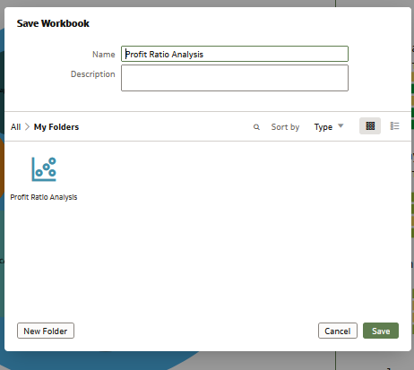

    Vous avez créé avec succès un workbook.
## Exercice Bonus : Auto Insights

Jusqu'à présent, nous avons créé un classeur sur la base d'un scénario défini et spécifique. Nous avons posé des questions et obtenu des réponses.

Nous avons ainsi obtenu des informations exploitables sur la baisse des ratios de rentabilité chez JTC Americas.

Pouvez-vous vous souvenir d'une occasion où, lorsqu'on vous présente une tâche d'analyse de données, vous ne savez pas exactement comment ou par où commencer face à un ensemble de données volumineux ?

Oracle Analytics Server peut automatiquement fournir des informations puissantes sur n'importe quel ensemble de données dans le système à l'aide d'une fonction appelée Auto Insights.

Auto Insight est un outil pratique pour comprendre vos données et constitue un excellent point de départ pour l'analyse..

Lorsque vous créez des DataSet ou ajoutez des DataSet à un Workbook, Oracle Analytics Server évalue l'ensemble de données et génère plusieurs suggestions via une carte de visualisation et un résumé descriptif en langage naturel. Le résumé explique la relation entre les attributs, les mesures et les points d'intérêt.

1.  Commençons par créer un dataset avec la feuille de calcul intitulée - ‘sampleOrderLines.xlsx’.

    

    

    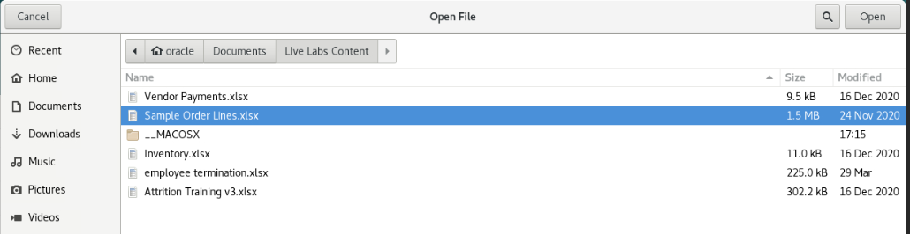

2.  Pour cet exercice, nous le laisserons tel quel. Ajoutez-le à Oracle Analytics Server et créez un workbook.

    

    **Cliquez** sur OK puis enregistrez le.

    

    

    Une fois enregistré, vous pouvez cliquer sur « Create Workbook »

    

    Remarquez l'icône d'une ampoule blanche dans le coin supérieur droit. Une fois qu'Auto Insights a évalué l'ensemble de données, l'icône devient jaune, ce qui indique qu'Oracle Analytics Server a identifié une série de suggestions d'informations.

3.  **Cliquez** sur Auto Insights pour examiner les idées suggérées dans le panneau à l'extrême droite.

    

    Chaque aperçu visuel est accompagné d'un résumé en langage naturel décrivant l'aperçu de la fonction que chaque visualisation apporte. Survolez le texte pour voir la description complète.

    Si vous êtes intéressé par un aperçu spécifique, cliquez simplement sur l'icône + dans la visualisation ou faites glisser la visualisation directement dans le canevas.

    Créez un canevas en sélectionnant certaines informations. Ajoutez les éléments suivants:

    1.  Measures Overview
    2.  Trending Dimensions
    3.  City Scatter Plot Chart
    4.  Top 10 City by Profit

        Lorsque vous avez terminé, réduisez le panneau des aperçus automatiques.

        

        ous remarquerez que chaque aperçu existe dans le canevas comme si vous aviez créé chaque objet de visualisation manuellement.

4.  Survolez le titre de chaque aperçu pour consulter son résumé en langage naturel. Vous pouvez ajouter une zone de texte pour afficher le résumé en langage naturel dans votre workbook.

    Sélectionnez le menu de visualisation à l'extrême gauche, puis sélectionnez "Text Box". Faites glisser la zone de texte au-dessus de Trending Dimensions.

    

    Copy (Ctrl-C) the text in the Title Tooltip field in the left-hand data panel (properties) of the workbook designer and paste (Ctrl-P) it in the 'Edit Text' box within the visualization.

    

    Vous pouvez modifier la zone de texte comme vous le souhaitez.

    

    Naviguez vers l'extrême gauche et explorez le panneau des éléments de données, puis faites défiler jusqu'en bas.

5.  Ouvrez ‘MyCalculations’.

    

    Remarquez que les calculs personnalisés correspondants ont été reportés dans le panneau des éléments de données à la suite de vos sélections de visualisation.

    Comme tout canevas, les éléments et les objets peuvent être filtrés ou modifiés en fonction de vos besoins. Vous pouvez utiliser les objets de visualisation insight comme modèle pour dupliquer ou modifier les objets de visualisation en fonction de vos besoins d'analyse.

    Cliquez droit sur le calcul 'Top 10 City by Profit Value'. Remarquez que vous pouvez modifier le calcul, le dupliquer ou le copier dans le presse-papiers.

    Sélectionnez 'Edit the Calculation. Vous pouvez voir la syntaxe et les fonctions utilisées pour chaque calcul.

    

    

    Modifions le calcul et examinons-le top 5 cities by profit value. Sauvegardez le calcul.

    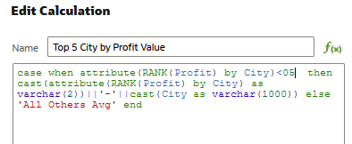

    N'oubliez pas de modifier le nom de la visualisation.

    Naviguez vers Data Prep et modifiez les métadonnées.

    À partir de l'écran du mileu, **Cliquez** data. **Cliquez** sur l'icône du crayon pour naviguer afin de visualiser les donnée.

    

    Naviguez vers la vue des métadonnées, indice - en haut à droite.

    

    Apporter les modifications suivantes :

    1.  Discount: modifiez l’aggrégation de 'Sum' vers 'Average'
    2.  Renommez 'Sales' en 'Revenue'
    3.  Masquer 'Product Sub Category'

        Sauvegardez votre Dataset.

6.  Une fois que vous avez sauvegardé, retournez à votre workbook via la fenêtre d'ouverture du workbook et cliquez sur « visualize ».

    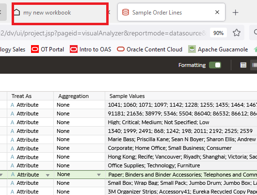

    Remarquez les changements apportés à votre classeur, et l'icône de l'ampoule est à nouveau blanche. Auto Insights s'exécute automatiquement et réévalue vos données.

    L'icône de l'ampoule deviendra jaune et fournira de nouvelles informations une fois l'opération terminée.
   

