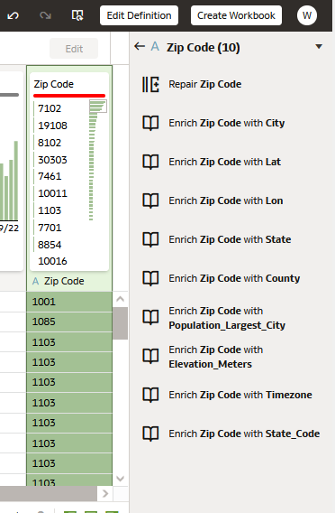
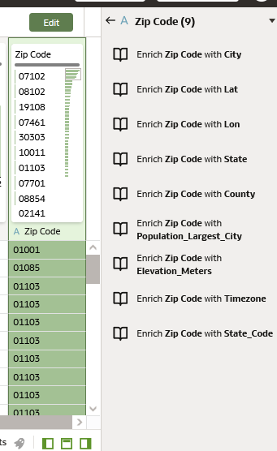
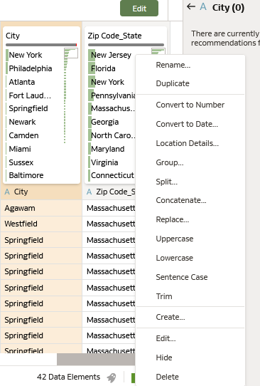
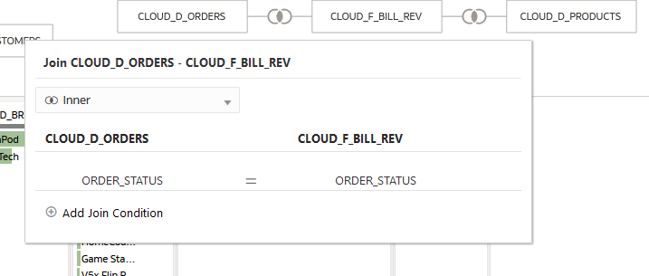
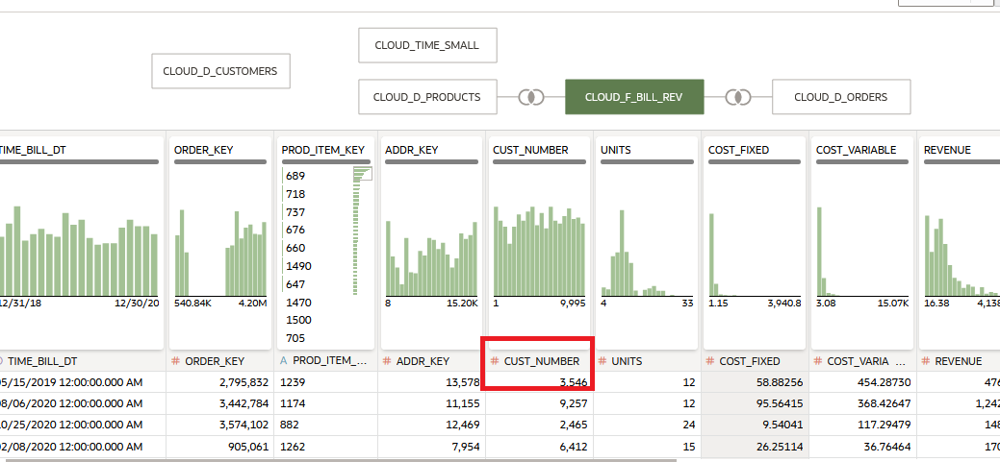
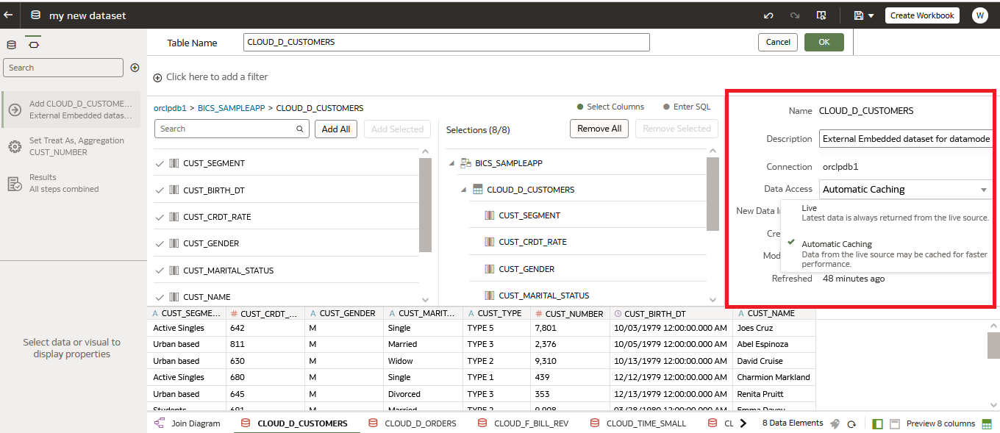

# Préparation des données en libre-service, enrichissement et modélisation des données

## Introduction

Les analystes et les administrateurs de bases de données passent beaucoup de temps à assembler et à préparer les données pour effectuer des analyses. Par conséquent, la capacité d'accéder rapidement aux volumes et à la variété des données disponibles aujourd'hui, de les exploiter et de leur donner un sens est essentielle pour conserver un avantage concurrentiel sur le marché actuel.

Oracle Analytics Server offre de puissantes capacités de gestion visuelle des données permettant aux utilisateurs de créer de nouveaux ensembles de données de manière dynamique et rapide.

Cet exercice vous présentera les fonctionnalités clés de la gestion des données en libre-service au sein d'Oracle Analytics Server.

## Créer et enrichir un Dataset

Dans ce chapitre, nous commencerons par les bases du téléchargement d'une feuille de calcul dans Oracle Analytics Server. Une fois le téléchargement réussi, nous examinerons les éléments de données et explorerons certaines des capacités de transformation et d'enrichissement des données qui permettent un processus de préparation des données fluide et homogène.

1.  Clicquez sur *"Create"* dans le coin supérieur droit.

    

2.  **Cliquez** sur Dataset dans le menu.

    

3.  **Uploadez** la feuille de calcul "employeeTermination.xlsx".

    

    Une fois uploadé, cliquez sur le bouton OK

    

    Sauvegardez votre Dataset puis cliquez sur « EmployeeTermniation » en bas de l’écran.

    

    Après avoir créé un dataset, celui-ci est soumis à un profilage au niveau des colonnes afin de produire un ensemble de recommandations sémantiques pour réparer ou enrichir vos données. Ces recommandations sont basées sur la détection automatique par le système d'un type sémantique spécifique au cours de l'étape de profilage. Après avoir profilé les données, vous pouvez les modifier et mettre en œuvre les recommandations d'enrichissement fournies à l'extrême droite de la palette. Gardez à l'esprit que les éléments spécifiques à la date et leurs types sémantiques dicteront la variété et le nombre de recommandations que vous recevrez et que vous pourrez inclure dans votre dataset.

    

4.  Utilisez la barre de défilement située en bas de l'écran et passez en revue les éléments de données. Chaque élément a été étiqueté avec un identifiant.
    -   A = Attribute
    -   '\#' = Measure
    -   Clock = Time

        Assurez-vous que vos éléments de données ont été correctement étiquetés, car l'affectation contrôlera les propriétés et les options d'analyse disponibles au cours de l'analyse.

        Utilisez la barre de défilement pour localiser l'ID et le numéro d'employé dans la source de données. Remarquez que chaque élément a été marqué d'un \#, ce qui indique qu'Oracle Analytics Server a identifié l'élément comme étant une mesure ou un élément numérique. Les numéros d'employés et les identifiants ne sont généralement pas des mesures à agréger ou à résumer. Ce sont des attributs utilisés à des fins d'identification.

        Modifier l'identifiant de l'élément de données pour les éléments de données ID et Employee.

        **Clicquez** sur la colonne ID. Remarquez la boîte de propriétés de l'ID dans le coin inférieur gauche. Modifions l'identifiant. Sous la propriété 'Treat As'. **Cliquez** sur 'measure' et sélectionnez attribute.

        

        Continuez et localisez le numéro de l'employé, et faites la même modification.

        

        En examinant les colonnes restantes, vous trouverez peut-être d'autres éléments de données à modifier.

5.  Continuez à faire défiler l'écran vers la droite jusqu'à ce que vous atteigniez la fin. Notez que l'ensemble de données comprend le numéro de sécurité sociale. **Cliquez** sur la colonne intitulée SSN. Le numéro de sécurité sociale est une donnée sensible et Oracle Analytics Server l'a reconnu et a émis 6 recommandations. Vous pouvez choisir de masquer, de supprimer ou d'extraire une partie de ces données d'un simple clic de souris.

    **Sélectionnez** 'Obfuscate First 5 digits of SSN'

    

6.  Encore plus à droite, au-delà du numéro de sécurité sociale, repérez la colonne ‘Zip Code’.

    Zip code a été identifié comme un attribut, mais certains enregistrements de codes postaux semblent incomplets.

    Vous remarquerez, au-dessus de l'en-tête de la colonne, que chaque élément de données est associé à une fiche d'information sur la qualité des données.

    Cette fiche fournit une visualisation illustrant les informations relatives à l'élément de données ainsi que des informations sur la distribution des enregistrements. En outre, elle donne un aperçu de la propreté des enregistrements dans chaque colonne.

    Notez la barre rouge en haut de la carte d'aperçu de la qualité des données. Survolez la barre rouge. Oracle Analytics Server a détecté les valeurs non valides en se basant sur la connaissance sémantique approfondie fournie par System Knowledge. System Knowledge fournit un vaste ensemble de données de référence géographiques et démographiques utilisées au cours du processus de profilage.

    **Cliquez** sur zip code et examinez les recommandations fournies par Oracle Analytics Server.

    Réparons les valeurs de Zip Code en sélectionnant la recommandation "Repair Zip Code'.

    

    Oracle Analytics Server a corrigé chaque enregistrement de code postal dans la colonne. Notez que la barre horizontale est passée du rouge au vert.

    

    En outre, je vois qu'Oracle Analytics Server a recommandé d'enrichir mon jeu de données en fournissant de nombreuses options de noms géographiques, y compris la ville et l'État.

    Améliorons l'ensemble de données en utilisant les recommandations relatives à l'État et à la ville pour notre analyse.

    Dans le panneau des recommandations, **cliquez** sur 'Enrich Zip Code with State', puis 'Enrich Zip Code with City'.

    

    Nous avons ajouté deux colonnes supplémentaires à notre dataset.

    Ensuite, nous renommerons chaque étiquette de colonne.

    Double-**Cliquez** sur l’étiquette de la colonne Zip Code_City.

    **Clicquez** ‘rename’ – saisissez ‘City’

    Procédez de la même manière pour renommer l'étiquette de la colonne Zip Code_State en State.

    **Cliquez droit** sur l’étiquette de la colonne Sate, Remarquez qu'il existe une grande variété d'options de transformation !

    

    Revenez à la gauche du dataset. Localisez la colonne "EducationField".

    Examinez les informations fournies dans la carte d'aperçu de la qualité des données.

    Oracle Analytics Server a identifié des valeurs manquantes ou nulles.

    La barre de qualité des données indique que 5 % des enregistrements sont des valeurs nulles.

    Vous pouvez remplacer des valeurs nulles ou manquantes en double-cliquant sur "Missing or Null" et en tapant la valeur de remplacement.

    Double-**Cliquez** 'Missing or Null' et saisissez 'Other'

7.  Effectuons une dernière modification de notre ensemble de données. Revenez au début du dataset, jusqu'à la gauche.

    Je souhaite combiner les colonnes "First Name" et "Last Name" en une seule colonne intitulée "Employee Name".

    Nous allons concaténer les colonnes pour les fusionner.

    **Cliquez droit** sur 'First Name' et sélectionnez 'concatenate'

    

    Dans la boite de dialogue concatenate, faites les modifications suivantes :

    -   Donnez un nouveau nom à la colonne – Employee Name
    -   Laissez Merge Column avec First Name
    -   Modifiez ‘With’ avec Last Name
    -   Laissez le délimiteur sur Space ( )
    -   Une fois fini, Cliquez sur ‘Add Step’

        **Cliquez droit** sur First Name et Last Name et sélectionnez ‘Hide’

8.  A côté de ‘Employee Name’, Il y a la colonne ‘Born’.

    Modifions l'intitulé de la colonne en "birthdate". Suivez les étapes énumérées ci-dessus pour "renommer" votre colonne..

    Ensuite, j'aimerais ajouter une colonne qui calcule ‘Age’.

    En haut à gauche, vous remarquerez une icône " + " dans le panneau de navigation des scripts.

    Examinez les éléments répertoriés dans le panneau de navigation des scripts. Le panneau de navigation des scripts a enregistré chaque modification que nous avons apportée à l'ensemble de données. Les modifications résident dans le dataset et seront appliquées lorsque la source de données sera actualisée ou ajoutée.

    

    **Cliquez** sur l'icône +. La boîte de dialogue Créer une colonne apparaît.

    Donnez un nom à la nouvelle colonne - Age

    Entrez votre calcul en tapant simplement dans la case ou en utilisant les fonctions énumérées dans le tableau de droite.

    J'aimerais calculer l'âge en utilisant la date du jour (date actuelle) et la colonne birthdate. Je dois utiliser la fonction année pour créer mon calcul.

    Dans la boîte, commencez à taper "year". Au fur et à mesure que vous tapez, vous remarquez qu' Oracle Analytics Server propose des choix correspondant à la saisie des données. Sélectionnez "Year" lorsqu'il s'agit d'une option.

    Remarquez que (dimension) apparaît à côté de Year. Utilisons la fonction de date du jour pour spécifier l’année.

    

    Commencez à taper "current". Au fur et à mesure que vous tapez, vous devriez voir apparaître des options correspondant à "current". **Sélectionnez** "current_date" lorsqu'il s'agit d'une option.

    Veillez à déplacer votre curseur en dehors de la parenthèse.

    -   Entrez un ‘ – ‘ pour la soustraction.

        Pour compléter nos calculs, nous utiliserons l'année spécifiée dans Birthdate.

    -   Répétez les étapes ci-dessus pour créer Year(Birthdate)

        Votre saisie devrait ressembler à ceci :

        

        Une fois terminé, **cliquez** sur ‘Validate’. Si le calcul a été saisi avec succès, **cliquez** sur ‘Add Step’.

        Je suis très satisfait de mon dataset. J'ai effectué plusieurs modifications et nettoyé mes données. Elles sont prêtes pour l'analyse.

        Nous sommes maintenant prêts à analyser nos données. **Cliquez** Create - Workbook.

        

        Vous pouvez commencer votre analyse en sélectionnant les éléments de données appropriés.

        Examinez les éléments de données "birthdate" et "Date left" répertoriés dans l'écran de contrôle.

        Cliquez sur “Birthdate. Remarquez qu'Oracle Analytics a créé automatiquement une dimension temporelle pour l'analyse.

        Vous pouvez découper vos données selon diverses dimensions temporelles sans avoir à écrire de code ou à transformer vos éléments spécifiques à la date..

        

## Self-service Data Modeling

Oracle Analytics Server permet de créer rapidement et facilement de nouveaux dataset en ajoutant des tables provenant d'une ou de plusieurs connexions à un dataset à des fins d'analyse. Cet exercice explique comment rassembler des entités de données provenant d'une ou de plusieurs sources, sélectionner différentes tables, modifier les colonnes et les joindre, puis prévisualiser l'ensemble de données.

Les dataset peuvent être combinés avec d'autres dataset, sauvegardés et partagés avec d'autres personnes au sein de l'organisation à des fins d'analyse.

Pour cet exercice, il vous faudra une connexion à une base de données Oracle. Nous allons créer cette connexion.

**Cliquez** sur create dans le coin supérieur droit puis **choisissez** Connection

Prenez quelques instants pour parcourir la liste des connexions disponible dans Oracle Analytics Server.

**Cliquez** ensuite sur Oracle Database dans les choix de connections

**Saisissez** les informations de connexions à l’identique de l’écran ci-dessous et **cliquez** sur Save un fois fait. Le mot de passe est *Admin123*.

La connexion est maintenant créée.

Nous pouvons commencer l’exercice.

1.  Create - Dataset

    

    .

    **Cliquez** sur la connexion orclpdb. La base de données dispose d'un grand nombre de schémas. Nous allons utiliser SAMPLEAPP.

    

2.  Nous souhaitons analyser les commandes des clients, les produits, le chiffre d'affaires et les informations relatives à la facturation. Je vais rassembler les tables dont j'ai besoin pour réaliser mon analyse..

    Commençons par sélectionner la table "CLOUD_D_CUSTOMERS". Vous pouvez double-cliquer dessus ou la faire glisser sur la palette.

    Une fois sélectionnée, la table est représentée par un diagramme dans la partie supérieure de la palette. En dessous, vous verrez les éléments de données qui résident dans la table.

    

    Nous allons ensuite sélectionner les autres tableaux dont nous avons besoin. **Cliquez** avec la touche CTRL enfoncée sur les tables suivantes:

    -   *CLOUD_D_PRODUCTS*
    -   *CLOUD_F_BILL_REV*
    -   *CLOUD_TIME_SMALL*
    -   *CLOUD_D_ORDERS*

        Une fois sélectionnées, **cliquez droit** et sélectionnez 'Add to dataset'

        

        Remarquez que quelques jointures ont été définies dans la source de données et qu'elles se sont donc produites automatiquement.

        

        **Cliquez** ou **survolez** le point de connexion.

        *CLOUD_F_BILLREV et CLOUD_D_ORDERS sont jointes sur Order_Status*

        

        *CLOUD_F_BILLREV et CLOUD_D_PRODUCTS sont jointes sur PROD_ITEM_KEY*

3.  Nous devons ajouter manuellement des jointures pour les tables CLOUD_D_CUSTOMERS et CLOUD_TIME_SMAL.

    **Cliquez s**ur CLOUD_F_BILLREV. CUST_NUMBER se trouve dans la table. Remarquez qu'il est identifié comme une mesure. Pour joindre CLOUD_F_BILLREV à CLOUD_D_CUSTOMERS, nous devons modifier l'identifiant**.**

    **Cliquez** sur le nom de la colonne \# CUST_NUMBER et modifiez l'identifiant en Attribute.

    

    **Cliquez** avec le bouton droit de la souris sur CLOUD_D_CUSTOMERS et sélectionnez Join To CLOUD_F_BILL_REV

    

    Notez que la jointure a été suggérée pour vous.

    

    **Cliquez** avec le bouton droit de la souris sur CLOUD_TIME_SMALL. Sélectionnez Joindre à CLOUD_F_BILLREV. Aucune correspondance claire entre les éléments de date n'a été identifiée. Sélectionnez CLOUD_F_BILLREV – TIME_BILL_DT et CLOUD_TIME_SMALL - DAY_TS

    Sauvegardons notre dataset afin de pouvoir terminer notre analyse. **Cliquez** sur l'icône de la disquette dans le coin supérieur droit.

    Nommez votre jeu de données - my new dataset

4.  Avant de passer à "Create Workbook", jetez un coup d'œil au bas de la palette, où se trouvent des onglets représentant toutes les tables que vous avez sélectionnées.

    **Cliquez** sur la table *CLOUD_D_CUSTOMERS*.

    

    Remarquez le panneau de recommandations sur la droite. Vous pouvez appliquer n'importe laquelle des recommandations fournies par le moteur de connaissances.

    En outre, vous pouvez cliquez sur ' Edit Definition '

    

    Remarquez ce qui suit:

    -   Vous pouvez ajouter ou supprimer des colonnes dans le tableau de données.
    -   Vous pouvez modifier l'indicateur de données si nécessaire.
    -   Vous pouvez modifier les paramètres d'accès aux données.

        

        **Cliquez** sur Ok, puis sur Create Workbook. Si vous y êtes invité, enregistrez les modifications apportées au dataset.

        Regardez le panneau des éléments de données à gauche. Chaque tableau est représenté par une icône de dossier.

        Vous êtes prêt à commencer votre analyse.

        Vous pouvez ajouter d'autres sources de données à votre analyse. **Cliquez** sur le + à droite du champ de recherche.

        

        À ce stade, vous pouvez :

    -   Ajouter un dataset
    -   Utiliser un subject area
    -   créer un nouveau dataset, en sélectionnant des données à partir de votre poste local ou d'une autre source de données.

        

        Oracle Analytics Server offre des capacités de gestion de données flexibles et agiles permettant aux utilisateurs d'accéder à une grande variété de sources de données et de les rassembler.
