# Analyse augmentée à l’aide du Machine Learning

## Introduction

L'une des caractéristiques les plus sophistiquées de l'offre d'Oracle Analytics est la possibilité d'exploiter l'analyse avancée et l'apprentissage automatique en cliquant sur un bouton, directement à partir de vos projets libre-service et de vos datasets. Les fonctions d'apprentissage automatique comprennent un ensemble d'algorithmes prédéfinis qui peuvent être utilisés pour extraire des informations de vos ensembles de données, telles que l'analyse des sentiments, l'analyse des séries temporelles, les résultats des prédictions et les scores de confiance.

Les fonctions analytiques avancées telles que les prévisions, l'analyse des tendances et le regroupement peuvent être appliquées à la visualisation dans votre canevas en un seul clic. En outre, les utilisateurs peuvent appeler des scripts d'apprentissage automatique personnalisés en utilisant la fonction d'évaluation des scripts à partir de vos projets en libre-service ou en ajoutant des scripts personnalisés dans le cadre de votre flux de données lors de la préparation des données..

## Utiliser le Machine Learning pour accélérer l’analyse

Dans ce chapitre, nous allons importer un ensemble de données contenant plusieurs enregistrements d'employés avec divers attributs qui enregistrent l'expérience, la performance et les incitations des employés. Les données sont historiques et comprennent un élément qui identifie si l'employé a quitté l'organisation.

-   Notez la colonne d'attrition, un indicateur binaire.
-   Chaque enregistrement d'employé contient une réponse "oui" ou "non".

Une fois que vous avez importé vos données dans Oracle Analytics, vous commencez par le profilage des données et l'examen des recommandations sémantiques pour réparer et enrichir vos données en vue d'une analyse plus approfondie. Ensuite, vous tirerez parti d'une capacité d'analyse améliorée appelée explain. Explain est utilisée pour générer des informations via une combinaison de traitement du langage naturel, de statistiques descriptives et de techniques de modélisation prédictive afin de mieux comprendre nos données et d'obtenir des informations plus approfondies avant notre analyse.

1.  sélectionnez Create .. Workbook.

    

2.  sélectionnez Create Dataset.

    

3.  Sélectionnez le fichier *“AttritionTrainingV3.xlsx”*

    

    Cliquez sur Ok pour ajouter le fichier au dataset.

    

    Une fois fait, enregistrez le fichier et nommer le « AttritionTrainingV3 ».

4.  Maintenant, localisez la colonne ID et cliquez sur l'icône hamburger en haut de la colonne. Cachons cette colonne puisque la colonne ID n'a aucune incidence sur le fait qu'un employé reste ou quitte notre organisation.  
    **Remarque** : cette même procédure peut être appliquée à toute colonne dont vous pensez qu'elle n'a pas d'incidence sur l'attrition.

    

    De même, trouvez la colonne Age et, à l'aide du panneau des propriétés dans le coin inférieur gauche, modifiez "Treat As" en Attribute et "Data Type" en Text. La raison en est que l'âge d'un employé peut effectivement avoir une incidence sur l'attrition, de sorte que l'évaluation de chaque âge distinct d'un employé pourrait être déterministe.

    

    Oracle Analytics affiche un ensemble de transformations de colonnes utiles appelées "Recommandations" lorsqu'il détecte des modèles dans vos données. Ces recommandations sont affichées dans un volet à droite. Trouvez la colonne SSN et sélectionnez la recommandation "Obfuscate Digits of SSN" (obscurcir les chiffres du SSN) pour cacher ces informations sensibles aux regards indiscrets. Enregistrez les modifications que nous avons apportées au dataset Attrition.

    

    **Remarque** : ces recommandations utiles représentent un élément clé de différenciation pour Oracle et sont conçues pour améliorer la productivité de l'utilisateur final tout en aidant les clients à mieux exploiter leurs données.

5.  Créons maintenant un workbook à l'aide du dataset que nous venons d'améliorer en cliquant sur le bouton "Create Workbook" en haut à droite.

    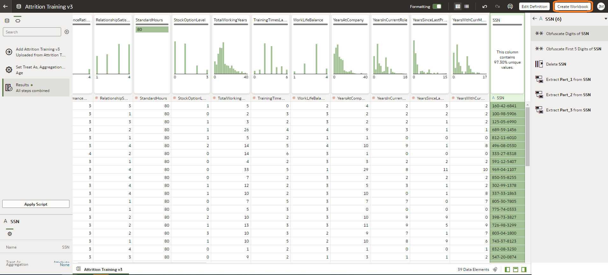

    Un nouveau classeur sera ouvert et le focus devrait être mis sur "Visualize" par défaut. Si ce n'est pas le cas, il suffit de choisir "Visualize" en haut de la page

    

    Dans le panneau "Data Elements" sur le côté gauche, trouvez l'attribut Attrition, puis cliquez dessus avec le bouton droit de la souris et sélectionnez "Explain Attrition" (expliquer l'attrition).

    

6.  Cette opération génère une fenêtre d'explication qui fournit des informations sur l'attrition. Ces informations sont divisées en 4 catégories. La première catégorie identifie les faits de base concernant notre attribut d'attrition. Dans ce cas, elle effectue des agrégations automatiques sur les lignes distinctes.

    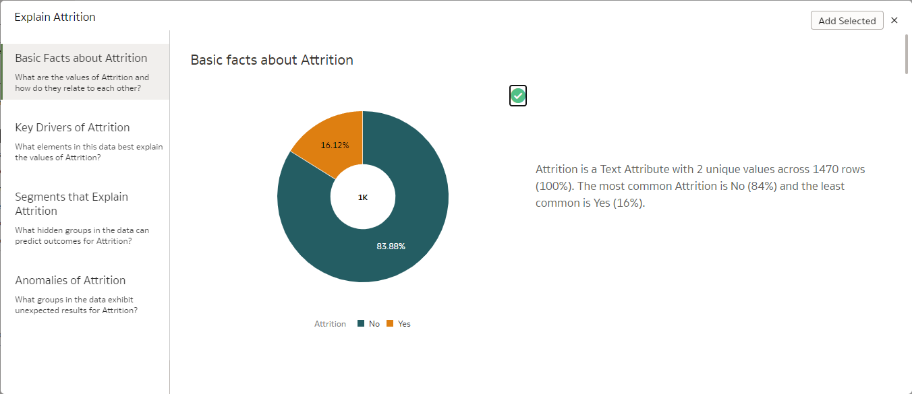

    L'attrition étant une variable binaire "oui/non", elle présente un diagramme circulaire montrant la répartition des employés qui ont quitté l'entreprise ou qui ne l'ont pas fait. Faites défiler vers le bas pour découvrir d'autres graphiques générés par Explain. Vous pouvez sélectionner toute information intéressante que vous souhaitez partager ou analyser plus en détail en cliquant sur la coche située dans le coin supérieur droit de chaque graphique.

    Naviguez jusqu'au deuxième onglet, qui identifie les facteurs clés liés à l'attribut d'attrition. Oracle Analytics s'appuie sur l'apprentissage automatique pour identifier les variables ayant la relation la plus déterministe avec les facteurs d'attrition. Les graphiques à barres fournissent une distribution de l'attrition pour chaque facteur clé.

    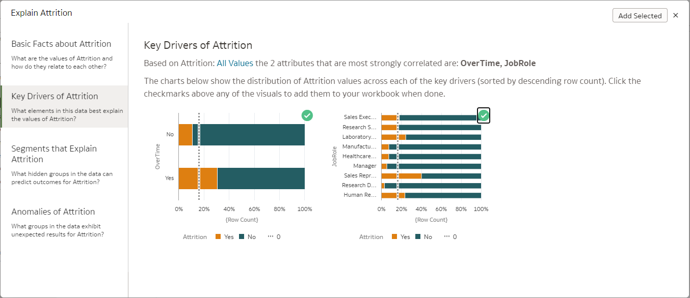

    **Remarque :** Ne pas tenir compte de l'ordre et de l'emplacement de l'écran pour les graphiques livrés via "Expliquer".

    Explain génère également des informations sur les segments, en identifiant les similitudes ou en regroupant les scénarios de profil dans lesquels il est plus ou moins probable que l'attrition soit un oui ou un non.

    

    Vous pouvez utiliser le menu déroulant pour passer d'un groupe de segments à l'autre afin d'identifier le degré de confiance du scénario.

    La quatrième catégorie d'informations illustre les anomalies de l'attrition ou des éléments peut-être inattendues. L'indicateur d'anomalie indique les combinaisons de chaque valeur distincte d'attrition par rapport à toutes les colonnes de l'ensemble de données, ce qui permet de mettre en évidence les valeurs aberrantes.

    

    Il visualise la valeur réelle et la valeur attendue, en mettant en évidence les endroits où la valeur réelle et la valeur attendue ne correspondent pas.

    Sélectionnez les graphiques suivants dans les onglets affichés par Explain:

    -   Attrition pie chart depuis le panneau Basic facts about Attrition
    -   JobRole & Overtime depuis le panneau Key Drivers of Attrition
    -   JobRole depuis le panneau Anomalies of Attrition

        **Remarque :** il se peut que vous deviez cliquer sur Rafraîchir l'affichage en bas du panneau Anomalies de l'attrition pour voir tous les graphiques générés.

Cliquez maintenant sur "Add Selected" en haut à droite pour ajouter ces visualisations à votre workbook. Le résultat devrait être un canevas nommé Explain Attrition contenant les visualisations que vous avez sélectionnées et que vous pouvez explorer davantage ou partager.

7.  Nous pouvons exécuter la fonction "explain" sur d'autres attributs ou mesures de notre ensemble de données. Lorsque vous exécutez "explain" sur un élément de données, un nouveau canevas est ajouté au classeur. Essayez d'expliquer l'attribut "EducationField" et sélectionnez quelques visualisations pour créer un nouveau canevas.

    

    Sélectionnez les graphiques suivants en fonction des résultats obtenus concernant EducationField:

    -   EducationField pie chart depuis le panneau Basic Facts about EducationField
    -   Department and JobRole depuis le panneau Key Drivers of EducationField
    -   Overtime anomalies chart depuis le panneau Anomalies of EducationField

**Remarque** : il se peut que vous deviez cliquer sur Rafraîchir l'affichage au bas du panneau Anomalies de EducationField pour voir tous les graphiques générés.

Cliquez sur "Add Selected" et un nouveau canevas pour EducationField sera ajouté au workbook, ce qui nous aidera à améliorer notre compréhension de l'attrition.

Avant de passer au chapitre suivant, enregistrez ce workbook en lui donnant un nom tel que *Attrition Analysis*

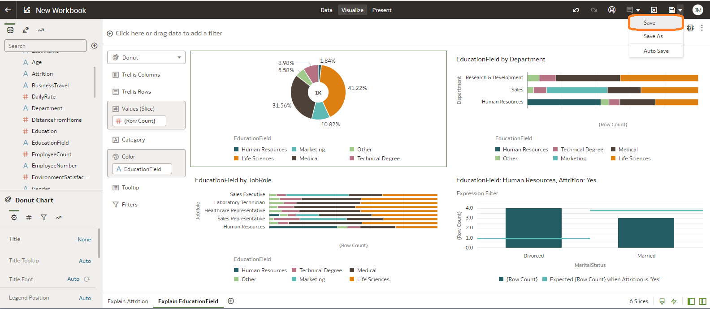

8.  Explorons plus avant l'attrition du dataset. Un élément que nous n'avons pas encore analysé en profondeur est le genre. Ajoutez un canevas à votre workbook en cliquant sur le signe + en bas de l'écran et renommez le canevas "Gender Analysis".

    

    Utilisez la barre de recherche située en haut à gauche dans le panneau du dataset pour générer une visualisation basée sur les éléments Gender:

    

    La recherche vous permet d'interroger votre dataset et de créer des visualisations basées sur les mesures et les attributs qui vous intéressent. Saisissez les noms de colonnes suivants : "EmployeeCount", "Attrition" et "Gender", en sélectionnant chaque colonne au fur et à mesure qu'elle apparaît. La fonction d'auto-complétion de la recherche est très pratique, de sorte qu'il suffit souvent de taper une partie du nom de la colonne pour la trouver. Sélectionnez chaque colonne au fur et à mesure qu'elle apparaît et ajoutez-la à la barre de recherche.

    Une fois les trois colonnes affichées dans la barre de recherche, il suffit de les faire glisser sur le canevas vide ou de choisir de créer une visualisation sous la barre de recherche, ce qui permet d'obtenir la visualisation suivante:

    

    Le résultat final devrait ressembler à ceci:

    

    Nous constatons qu'en chiffres bruts, plus d'hommes que de femmes ont quitté notre organisation. Changeons de type de graphique pour déterminer proportionnellement le nombre d'hommes et de femmes qui ont quitté l'organisation. Il est facile de modifier le type de graphique en sélectionnant un autre graphique à l'aide des icônes situées en haut à droite du graphique ou dans le panneau de mise en page du graphique. Quelle que soit la méthode utilisée, modifiez la présentation du graphique pour en faire un diagramme à barres horizontales empilées à 100 %. Ensuite, il suffit de faire glisser le genre vers la catégorie (X-Axis) et l'attrition vers la couleur pour que nous puissions voir le pourcentage d'hommes et de femmes qui quittent l'entreprise ou qui restent, comme indiqué ci-dessous:

    

    Utilisons maintenant une fonction d'analyse avancée en un seul clic pour approfondir la question du genre. Dans le panneau des éléments de données, utilisez la touche multisélection de votre ordinateur pour sélectionner *Gender*, *EnvironmentSatisfaction*, *WorklifeBalance*, et *Last Name*. quez ensuite avec le bouton droit de la souris et choisissez l'option *Scatter* chart. Finalement, déplacez *Gender* vers Trellis Columns. Votre visualisation devrait ressembler à ceci:

    

**Remarque :** vous pouvez simplement faire glisser une visualisation au-dessus, au-dessous ou à côté d'une autre visualisation pour les ordonner comme vous le souhaitez.

À n'importe quel endroit du diagramme de dispersion, cliquez avec le bouton droit de la souris et choisissez *Add Statistics .. Outliers*. Les valeurs aberrantes seront mises en évidence par des couleurs différentes pour faciliter leur identification.

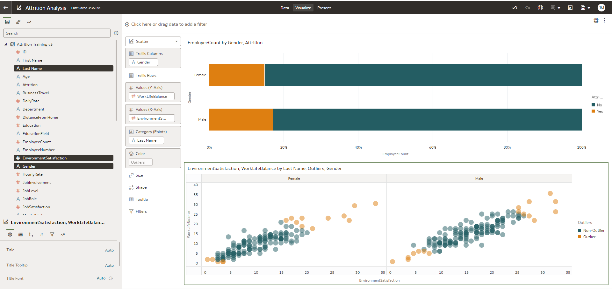

Si l'on considère les employés qui ne sont pas dans les valeurs aberrantes (ce qui représente la majorité), on constate que les femmes semblent avoir un niveau de satisfaction environnementale et d'équilibre entre vie professionnelle et vie privée inférieur à celui de leurs homologues masculins. Il s'agit peut-être d'un facteur clé pour comprendre ce qui pousse les femmes à quitter notre organisation.

Sauvegardez votre analyse.

## Tirer parti du Machine Learning dans Oracle Analytics Server pour prévoir les départs volontaires

Cet exercice explorera comment le machine learning en libre-service permet l'analyse prédictive en utilisant les modèles d'apprentissage automatique natifs contenus dans Oracle Analytics Server. Nous allons maintenant étendre notre analyse en voyant comment nous pouvons prédire si un employé est susceptible de quitter l'organisation. Pour ce faire, nous utiliserons un modèle de classification binaire. Avant de nous aventurer plus loin, essayons de comprendre brièvement ce qu'est la classification binaire.

La classification binaire est une technique qui consiste à classer les éléments d'un ensemble de données donné en deux groupes sur la base de règles de classification, par exemple la prédiction de l'attrition des employés, c'est-à-dire si l'on s'attend à ce que l'employé parte ou ne parte pas. Ces règles de classification sont générées lorsque nous formons un modèle à l'aide d'un ensemble de données de formation qui contient des informations sur les employés et indique si l'employé a quitté l'entreprise ou non.

1.  Sur la page d'accueil, cliquez sur le bouton Create et sélectionnez Dataflow.

    

2.  Sélectionner le dataset que nous analysons “Attrition Training V3.” et cliquez sur Add.

    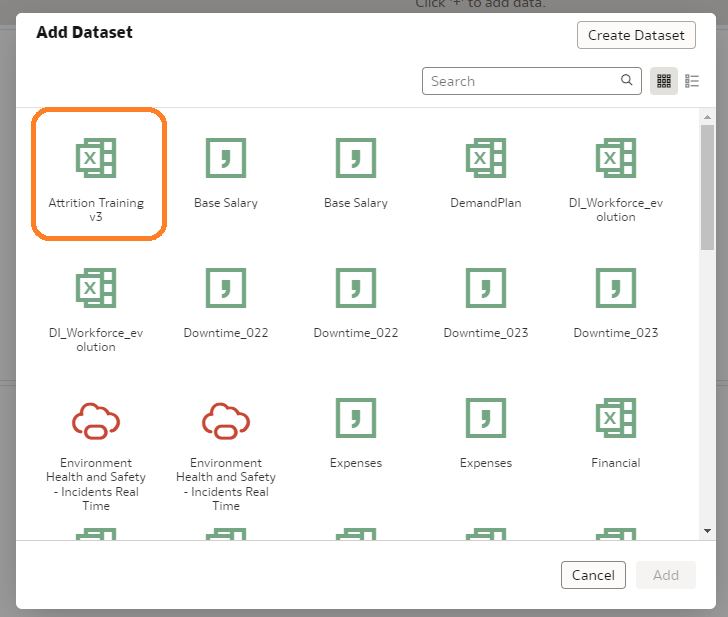

3.  Ce dataset sera ajouté en tant que source d'information pour notre data flow.

    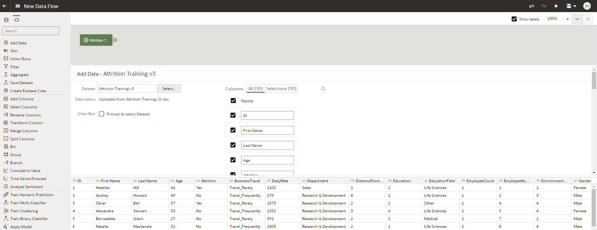

4.  Dans le dernier exemple, nous avons constaté qu'il y avait de l'attrition dans notre département et nous avons pris note de certains des facteurs identifiés à l'aide de la fonction d'explication. Ce que nous voulons faire maintenant, c'est construire et entraîner un modèle d'apprentissage automatique pour prédire si quelqu'un est susceptible de quitter l'organisation. Ajoutons un algorithme de machine learning à notre flux de donnée.

    Sélectionnez l’icone *plus*  sur les données sources et sélectionnez *Train Binary Classifier*.

    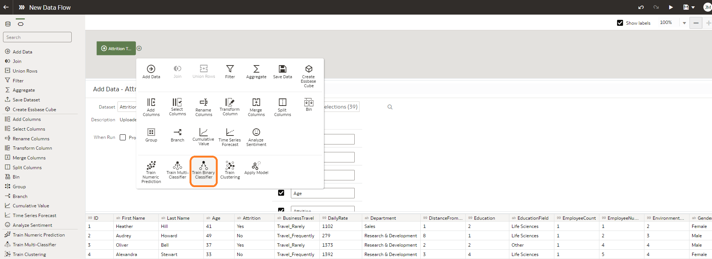

5.  Sélectionnez *Naïve Bayes for Classification* et cliquez OK.
6.  Sélectionnez l’attribut *Attrition* comme colonne cible du modèle. Assurez-vous que la classe positive est *Yes* et laisser les autres options par défaut.

    

7.  Cliquez *Save Model* et donnez au modèle un nom comme "AttritionPredict-BC-NB".

    

8.  Sauvegardez votre Data Flow avec un nom comme *AttritionPredict-BC-NB* ou similaire

    

9.  Exécutez le Data Flow une fois qu'il a été enregistré. Attendre la fin du Process.

    

10. Quittez le Data Flow et à partir de la page d'accueil , Ouvrez l'onglet Machine Learning pour examiner les résultats du modèle de classification.

    

11. Nous pouvons vérifier la validité de notre modèle de machine learning .Cliquez sur les points situés sur le côté droit et sélectionnez "Inspect".

    

12. Nous pouvons inspecter le modèle pour voir plus de détails comme la qualité du modèle (matrice de confusion, précision, rappel) et les dataset générés.L'onglet qualité identifie la qualité globale du modèle à l'aide d'une série de mesures connexes : La précision globale du modèle est de 87% et la précision est de 65%.

    

13. Étant donné que le modèle a obtenu un taux de precision de 87 %, appliquons-le à un ensemble de données d'employés qui restent dans notre organisation pour voir lesquels d'entre eux pourraient être enclins à partir. Cliquez sur les trois points en haut à droite, puis sur sélectionnez *Import Workbook/Flow*.

    

14. sélectionnez le fichier *Employee-Analysis.dva* .

    

15. Entrez le mot de passe *“Admin123”*.

    

16. Recherchez et ouvrez le workbook intitulé Employee Analysis. Nous disposons ici d'un workbook existant qui présente 470 employés au sein de notre organisation. Nous allons appliquer notre nouveau modèle de formation à la classification à cet ensemble de données que nous avons importé avec ce workbook.

    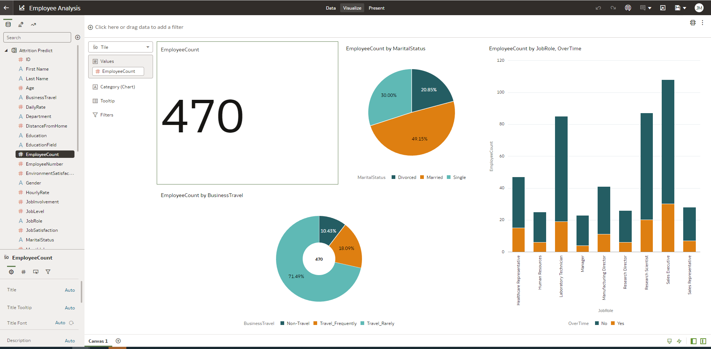

17. Allez dans l'onglet Accueil et créez un nouveau *data flow*.

    

18. Sélectionnez le nouveau dataset “Attrition Predict”.

    

19. Cliquez sur l’icône *plus icon* .

    

20. Sélectionnez *Apply Model* .

    

21. Sélectionnez notre modèle de Machine Learning et cliquez OK.

    

22. Notre modèle d'application comportera 3 sections.
    -   **Outputs** - il s'agit d'une liste de colonnes renvoyées par le modèle en plus des colonnes d'entrée. L'application du modèle enrichira notre dataset sur les employés en ajoutant une valeur prédite et un score de confiance de prédiction.
    -   **Parameters** - Les paramètres facultatifs que les utilisateurs peuvent passer pour appliquer le modèle.
    -   **Inputs** - Il s'agit des colonnes d'entrée du modèle pour l "apply".

        Le modèle d'application tentera de faire correspondre automatiquement les noms de colonnes dataset d'entrée aux noms de colonnes du modèle..

        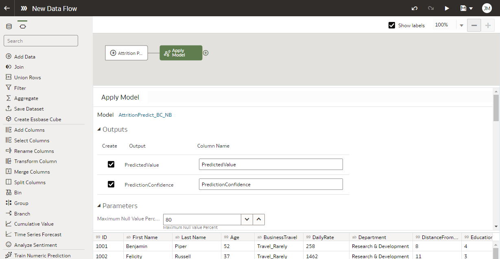

23. Sélectionnez l’icône *plus icon* et sélectionnez *Save Data* .

    

24. Donnez lui donner le nom “AttritionPredicted”.

    

25. **Remarque** : nous pouvons exécuter ce data flow dans une base de données existante si nous le souhaitons. Pour l'instant, il s'agit du stockage par défaut des datasets.
26. Enregistrez le data flow sous le nom “AttritionPredicted”.

    

27. Une fois le data flow sauvegardé, exécutez-le .

    

    Cela produira un nouvel dataset qui ajoutera les valeurs prédites à notre dataset existant.

28. Allez à l’onglet "Data" et sélectionnez le nouveau dataset “AttritionPredicted”.

    

29. Certaines colonnes peuvent être stockées de manière incorrecte. Comme nous l'avons fait dans les exercices précédents, assurez-vous que :

Les colonnes suivantes sont stockées en tant que mesures:

-   PredictionConfidence
    -   EmployeeCount
    -   Le numéro d'employé est un attribut.

        

30.  Créez des visualisations comme l'exemple suivant:
    -   Performance Tile pour EmployeeCount
    -   Donut chart pour EmployeeCount par JobRole et Department
    -   Table avec les colonnes EmployeeNumber, First Name, Last Name, PredictionConfidence, PredictedValue

        

31.  Sauvegardez le workbook en le nommant “AttritionPredicted”.

    

## Tirer parti du machine learning dans la base de données Oracle pour prédire les départs volontaires

Cet exercice explorera comment tirer parti de l'apprentissage automatique de la base de données Oracle (OML) à partir d'Oracle Analytics Server. La principale différence par rapport à l'exercice précédent est que nous avons utilisé un modèle d'apprentissage automatique natif fonctionnant dans OAS pour prédire l'attrition. Si cette approche fonctionne bien avec des quantités limitées de données, elle n'est pas forcément optimale lorsque l'on travaille avec de grandes quantités de données. La base de données Oracle offre des avantages de performance distincts pour l'hébergement de charges de travail d'apprentissage automatique que Oracle Analytics Server ne peut tout simplement pas égaler. La base de données Oracle peut exploiter les constructions en mémoire, le traitement parallèle, les plans de requête sophistiqués, etc. pour fournir un environnement très robuste pour les charges de travail d'apprentissage automatique. Il est également courant dans l'industrie qu'une équipe de développement professionnel forme, teste, évalue et déploie des modèles d'apprentissage automatique dans un environnement de calcul dédié robuste tel que la base de données Oracle. Notre objectif dans cet exercice est donc d'illustrer comment un analyste peut facilement et rapidement exploiter les modèles de machine hébergés dans la base de données Oracle à partir d'Oracle Analytics Server.

Dans ce scénario, nous commencerons par enregistrer un modèle d'apprentissage automatique que nos scientifiques professionnels ont préalablement formé, testé et déployé dans la base de données Oracle. Une fois enregistré, nous appellerons ce modèle pour prédire qui, dans notre organisation, est susceptible de quitter l'organisation.

Pour cet exercice, nous allons réutilisés la connexion crée à l’exercice 2 du chapitre précédent. Nous allons créer un Dataset à partir de cette connexion. Les données sur les employés nécessaires pour prédire qui pourrait quitter notre organisation se trouvent déjà dans notre base de données Oracle

**Remarque** : pour exploiter pleinement les capacités de l'OML, le modèle d'apprentissage automatique et les données nécessaires pour faire une prédiction doivent tous deux se trouver dans la base de données Oracle

1.  Depuis l’Accueil, Cliquez sur Create puis choisissez Dataset

    

2.  Sélectionnez la connection ‘orclpdb’, sélectionnez la table EMPLOYEE_DATA dans le schéma dmuser01, puis déposer la dans le panneau à droite de l’écran.

     

3.  Modifiez les colonnes Age et EmployeeNumber en attribut et sauvegardez le dataset avec le nom EMLOYEE_DATA.
4.  Retournez à l’accueil, et en haut à droite, cliquez sur les trois points verticaux pour ouvrir le menu déroulant, puis sélectionnez Register ML Model.

    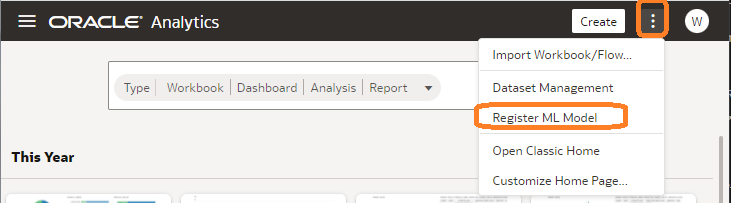

5.  Sélectionnez la connexion orclpdb qui a été créée au début du chapitre.

    

6.  Maintenant, sélectionnez "*ATTRITION-MODEL-SVM*" dans la liste des modèles ML disponibles et cliquez sur Register en bas de la page.

    

7.  Depuis la page d'accueil, cliquez sur le bouton hamburger en haut à gauche, sélectionnez Machine Learning, et pour le modèle ATTRITION-MODEL-SVM que nous venons d'enregistrer, sélectionnez l'option Inspecter à l'aide des trois points verticaux qui apparaissent sur le côté droit du modèle.

    

8.  Inspecter le modèle enregistré. Remarquez qu'il y a plus de métadonnées apparaissant sur les modèles OML hébergés dans la base de données Oracle que sur les modèles ML natifs hébergés dans Oracle Analytics Server. Cela montre que les modèles OML sont beaucoup plus sophistiqués. Parcourez les différents onglets (Général, Accès, Détails, Related). Remarquez que sous Détails - Colonnes de sortie, il y a une Prédiction et une PrédictionProbabilité qui nous diront qui est susceptible de partir ensuite. De même, l'onglet Related propose une série de métadonnées sous-jacentes stockées dans des vues DM\$ au sein de la base de données Oracle, contenant des détails importants sur la manière dont le modèle a été formé, testé et évalué

    

9.  Notre modèle OML enregistré est maintenant prêt à être appelé par Oracle Analytics Server pour faire des prédictions concernant les employés qui sont susceptibles de quitter l'organisation. Pour appeler ce modèle OML enregistré, cliquez sur Create en haut à droite de la page, puis choisissez Data Flow.

    

10. Le flux de données de création vous demandera quel(s) dataset(s) vous souhaitez utiliser. Tapez "EMP" dans la fenêtre de recherche, puis sélectionnez EMPLOYEE-DATA et Add pour introduire un dataset contenant des informations clés sur les employés restants qui travaillent encore pour notre organisation.

    

11. Cliquez sur le signe + à droite du nœud EMPLOYEE_DATA que nous venons d'ajouter au dataflow et choisissez Apply Model au bas des éléments présentés.

    

12. Sélectionnez ATTRITION-MODEL-SVM que nous avons enregistré à l'étape 6 ci-dessus, puis cliquez sur OK.

    

13. Étant donné qu'un dataset similaire a été utilisé pour former et tester notre modèle, les sorties Prediction et PredictionProbability sont automatiquement mises en correspondance avec les colonnes d'entrée nécessaires à la création de nos prédictions.

    

14. Cliquez sur le signe + à droite du nœud Apply Model et choisissez Save Data

    

15. Sauvegardez le nouveau dataset dans la base orclpdb avec le nom PRED_EMP_ATTRIT. Donnez ce nom également pour le dataset.

    

16. Sauvegardez votre data flow en le nommant PRED-EMP-ATTRIT-OML puis, en utilisant la flèche en haut à droite de la page, exécutez l'ensemble de données pour créer les prédictions.

    

17. Une fois le modèle appliqué quittez le data flow que vous venez de créer.
18. En utilisant l'icône hamburger en haut à gauche de la page, ouvrez le panneau DATA et entrez EMP pour voir tous les ensembles de données contenant "EMP" dans leur nom. Cliquez sur le dataset PRED-EMP-ATTRIT pour créer un nouveau workbook.

    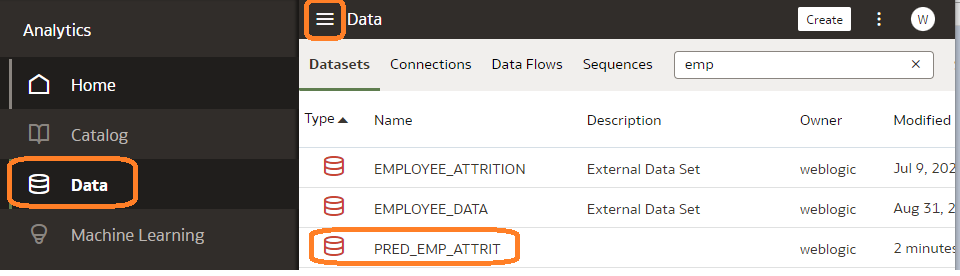

19. Sélectionnez toutes les colonnes de l'ensemble de données, cliquez avec le bouton droit de la souris et sélectionnez Pick Visualization (Choisir la visualisation). Choisissez ensuite la visualisation Tableau pour afficher les prédictions.

    

20. En utilisant la technique du glisser-déposer, réorganisez les colonnes de chaque ligne de manière à ce que Prediction, PredictionProbabilité et EmployeeNumber apparaissent sur le côté droit du tableau. Vous pouvez également déplacer des attributs clés tels que DEPARTMENT, JOBROLE, ... vers le côté droit.

    

21. Cliquez sur l'attribut Prédiction et faites-le glisser vers la section Filtres en haut de la page, puis filtrez uniquement sur les salariés dont la prédiction est Oui, ce qui signifie qu'ils sont susceptibles de partir. Triez ensuite sur la base de "PredictionProbability" de haut en bas pour voir les employés qui ont le plus grand risque de partir.

    

22. Continuez à construire des visualisations qui, selon vous, pourraient aider à comprendre les prévisions d'attrition jusqu'à ce que vous obteniez un canevas intéressant.

    
